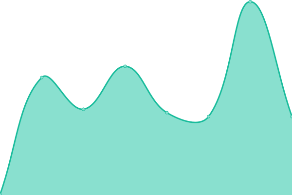
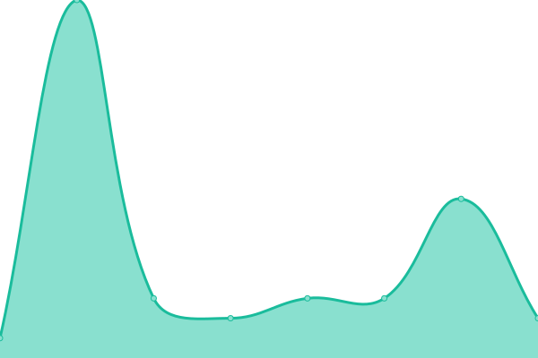
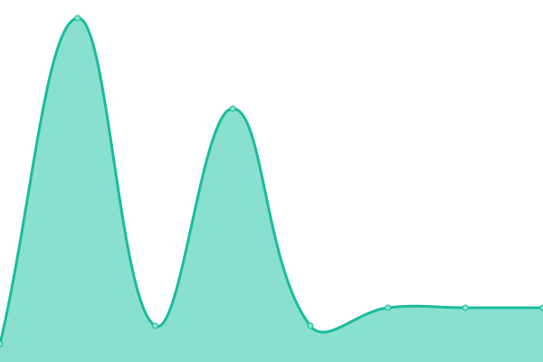

# [📈 Live Status](https://status.seamlesscare.ca): <!--live status--> **🟩 All systems operational**

[**Visit our status website →**](https://status.seamlesscare.ca)

# Home Portal

# Pharmacy App

# Status Pages and Badges Deployement Details

<!--start: status pages-->
<!-- This summary is generated by Upptime (https://github.com/upptime/upptime) -->
<!-- Do not edit this manually, your changes will be overwritten -->
<!-- prettier-ignore -->
| URL | Status | History | Response Time | Uptime |
| --- | ------ | ------- | ------------- | ------ |
|  [Home Portal](https://portal.seamlesscare.ca) | 🟩 Up | [home-portal.yml](https://github.com/SeamlessCare/status/commits/HEAD/history/home-portal.yml) | 

 325ms
     
 | 

<a href="https://status.seamlesscare.ca/history/home-portal">100.00%</a>
    

|  [Pharmacy App](https://app.seamlesscare.ca) | 🟩 Up | [pharmacy-app.yml](https://github.com/SeamlessCare/status/commits/HEAD/history/pharmacy-app.yml) | 

 330ms
     
 | 

<a href="https://status.seamlesscare.ca/history/pharmacy-app">100.00%</a>
    

|  [Home Portal Ping](portal.seamlesscare.ca) | 🟩 Up | [home-portal-ping.yml](https://github.com/SeamlessCare/status/commits/HEAD/history/home-portal-ping.yml) | 

 30ms
     
 | 

<a href="https://status.seamlesscare.ca/history/home-portal-ping">100.00%</a>
    

|  [Pharmacy App Ping](app.seamlesscare.ca) | 🟩 Up | [pharmacy-app-ping.yml](https://github.com/SeamlessCare/status/commits/HEAD/history/pharmacy-app-ping.yml) | 

 32ms
     
 | 

<a href="https://status.seamlesscare.ca/history/pharmacy-app-ping">100.00%</a>
    

<!--end: status pages-->

## check the status

https://raw.githubusercontent.com/seamlesscare/status/master/api/home-portal/uptime.json
https://raw.githubusercontent.com/seamlesscare/status/master/api/pharmacy-app/uptime.json
